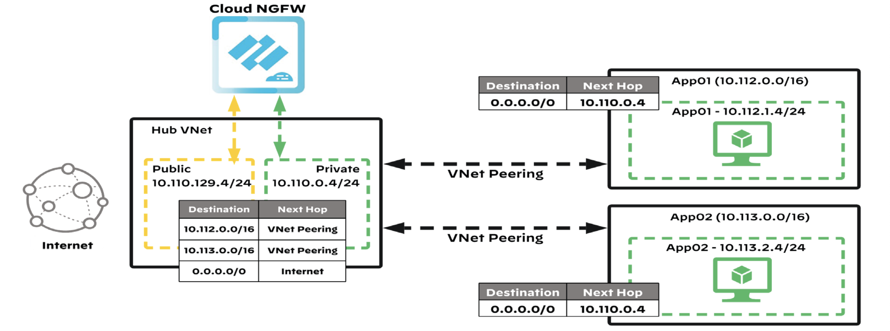

# Cloud NGFW Panorama Managed on Azure vNet
This Terraform template deploys a Panorama Managed Cloud NGFW on Azure vNet. With two Linux VMs in two spoke vNets and the CNGFW in the Hub vNet. 

It also creates the necessary logging elements and firewall configuration in order to receive logs on both Panorama (in Panorama Mode or dedicated Log Collector) and Azure Log Analytics.

Optionally, configures Device Group Log Forwarding Profile and Security Policies in Panorama.

Based on the deployment guide: https://www.paloaltonetworks.com/resources/guides/securing-apps-with-cloud-ngfw-for-azure-dep-guide-vnet




## Prerequisites

1. Terraform and azure-cli installed in your computer (alternatively, use Azure Cloud Shell)
   - Log into Azure
      ```bash
      az login
      ```
    - Verify you are in the correct Azure subscription
      ```bash
      az account show
      ```
    - If you are not in the correct subscription, switch to it:
      ```bash
      az account set --subscription "<subscription_id_or_subscription_name>"
      ```
    - Verify that Terraform is properly installed
      ```bash
      terraform version
      ```

2. Panorama - See section "Preparing Panorama for use with Cloud NGFW", from page 42 of the [deployment guide](https://www.paloaltonetworks.com/resources/guides/securing-apps-with-cloud-ngfw-for-azure-dep-guide-vnet)
   - Panorama mode or dedicated Log Collector with reachable public IP address
   - Azure Plugin installed
   - Template Stack configured
   - Log Collector and Log Collector Group configured
   - Panorama registration PIN generated in the Customer Support Portal --> Device Certificates
   - Panorama registration string generated
   - Configure log forwarding profile and security policies either manually or automátically (see item #6 in deployment section below)
   
3. Git clone this repository: https://github.com/DctrG/azure-vnet-cngfw.git (or download its content to your computer)

## Deployment

1. Update the "terraform.tfvars" file with the necessary information.
   - "prefix", this will be a string to uniquely identify your resources
   - "location", this specifies the supported Azure location where the resource exists. Example: "East US"
   - "linux_username", this is the username for the Linux VMs
   - "linux_password", this is the password for the Linux VMs
   - panorama-string, this is the registration string generated in the Panorama Plugin Azure CNGFW setup

2. Run 
   ```bash
   terraform init
   ```

3. Run 
   ```bash
   terraform apply     # answer "yes" if you are happy with the plan
   ```

4. Demo environment will be deployed. It takes about 25-30 minutes for the environment to be fully ready

5. The public IP of the CNGFW will be shown in the terraform output

6. Optional. If you want Terraform to create the logging profile and security policies, do the following:
   - Edit the file Panorama/terraform.tfvars and provide your Panorama IP, admin user/passwd, Device Group name, Log Forwarding Profile name and Template Stack name 
   - Run
   ```bash
   cd Panorama
   terraform init
   terraform apply
   ```

## Testing

1. In Panorama, verify the Cloud NGFW firewalls are under Managed Devices and connected, then do a commit & push 

2. From your computer, browse to the CNGFW public ip address on port 8080, this will DNAT to \<prefix\>-cngfw-linuxvm-1 on port 80 displaying the Apache welcome page

3. From Azure Portal, go into the serial console of \<prefix\>-cngfw-linuxvm-1
   ```bash
   sudo apt update         # connects to apt sources (allowed)
   wget 10.113.1.4         # downloads index.html from <prefix>-cngfw-linuxvm-2 (allowed)
   wget 10.113.1.4:4444    # denied
   wget www.google.com     # denied
   ```
4. Go to Panorama Monitor, filter by the correct Device Group and inspect the logs

## Destroying
   ```bash  
   terraform destroy
   ```

## Support Policy
The code and templates in the repo are released under an as-is, best effort,
support policy. These scripts should be seen as community supported and
Palo Alto Networks will contribute our expertise as and when possible.
We do not provide technical support or help in using or troubleshooting the
components of the project through our normal support options such as
Palo Alto Networks support teams, or ASC (Authorized Support Centers)
partners and backline support options. The underlying product used
(the VM-Series firewall) by the scripts or templates are still supported,
but the support is only for the product functionality and not for help in
deploying or using the template or script itself. Unless explicitly tagged,
all projects or work posted in our GitHub repository
(at https://github.com/PaloAltoNetworks) or sites other than our official
Downloads page on https://support.paloaltonetworks.com are provided under
the best effort policy.